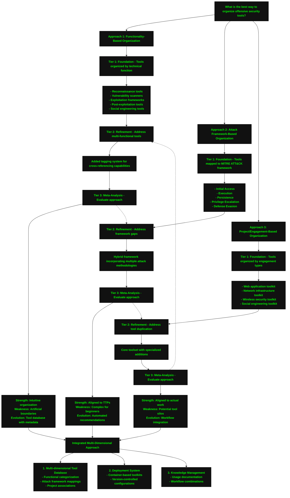

```mermaid
graph TD
    classDef root fill:#111,stroke:#000,stroke-width:2px,color:#0f0,font-weight:bold,font-size:14px
    classDef branch fill:#111,stroke:#000,stroke-width:2px,color:#0f0,font-weight:bold,font-size:14px
    classDef tier1 fill:#111,stroke:#000,stroke-width:2px,color:#0f0,font-weight:bold,font-size:14px
    classDef tier2 fill:#111,stroke:#000,stroke-width:2px,color:#0f0,font-weight:bold,font-size:14px
    classDef tier3 fill:#111,stroke:#000,stroke-width:2px,color:#0f0,font-weight:bold,font-size:14px
    classDef output fill:#111,stroke:#000,stroke-width:2px,color:#0f0,font-weight:bold,font-size:14px
    classDef integration fill:#111,stroke:#000,stroke-width:2px,color:#0f0,font-weight:bold,font-size:14px

    %% Root Question
    Root["What is the best way to organize offensive security tools?"] 
    
    %% Branches - First level of Tree of Thought
    Branch1["Approach 1: Functionality-Based Organization"]
    Branch2["Approach 2: Attack Framework-Based Organization"]
    Branch3["Approach 3: Project/Engagement-Based Organization"]
    
    %% Tier 1: Foundational Prompting for each branch
    B1T1["Tier 1: Foundation - Tools organized by technical function"]
    B2T1["Tier 1: Foundation - Tools mapped to MITRE ATT&CK framework"]
    B3T1["Tier 1: Foundation - Tools organized by engagement types"]
    
    %% Outputs from Tier 1
    B1T1Out["- Reconnaissance tools
- Vulnerability scanners
- Exploitation frameworks
- Post-exploitation tools
- Social engineering tools"]
    B2T1Out["- Initial Access
- Execution
- Persistence
- Privilege Escalation
- Defense Evasion"]
    B3T1Out["- Web application toolkit
- Network infrastructure toolkit
- Wireless security toolkit
- Social engineering toolkit"]
    
    %% Tier 2: Iterative Refinement for each branch
    B1T2["Tier 2: Refinement - Address multi-functional tools"]
    B2T2["Tier 2: Refinement - Address framework gaps"]
    B3T2["Tier 2: Refinement - Address tool duplication"]
    
    %% Outputs from Tier 2
    B1T2Out["Added tagging system for cross-referencing capabilities"]
    B2T2Out["Hybrid framework incorporating multiple attack methodologies"]
    B3T2Out["Core toolset with specialized additions"]
    
    %% Tier 3: Meta-Prompting for each branch
    B1T3["Tier 3: Meta-Analysis - Evaluate approach"]
    B2T3["Tier 3: Meta-Analysis - Evaluate approach"]
    B3T3["Tier 3: Meta-Analysis - Evaluate approach"]
    
    %% Outputs from Tier 3
    B1T3Out["Strength: Intuitive organization
Weakness: Artificial boundaries
Evolution: Tool database with metadata"]
    B2T3Out["Strength: Aligned to TTPs
Weakness: Complex for beginners
Evolution: Automated recommendations"]
    B3T3Out["Strength: Aligned to actual work
Weakness: Potential tool silos
Evolution: Workflow integration"]
    
    %% Integration and Final Solution
    Integration["Integrated Multi-Dimensional Approach"]
    Solution1["1. Multi-dimensional Tool Database
- Functional categorization
- Attack framework mappings
- Project associations"]
    Solution2["2. Deployment System
- Container-based toolkits
- Version-controlled configurations"]
    Solution3["3. Knowledge Management
- Usage documentation
- Workflow combinations"]
    
    %% Connections - Core structure
    Root --> Branch1
    Root --> Branch2
    Root --> Branch3
    
    Branch1 --> B1T1
    Branch2 --> B2T1
    Branch3 --> B3T1
    
    B1T1 --> B1T1Out
    B2T1 --> B2T1Out
    B3T1 --> B3T1Out
    
    B1T1Out --> B1T2
    B2T1Out --> B2T2
    B3T1Out --> B3T2
    
    B1T2 --> B1T2Out
    B2T2 --> B2T2Out
    B3T2 --> B3T2Out
    
    B1T2Out --> B1T3
    B2T2Out --> B2T3
    B3T2Out --> B3T3
    
    B1T3 --> B1T3Out
    B2T3 --> B2T3Out
    B3T3 --> B3T3Out
    
    B1T3Out --> Integration
    B2T3Out --> Integration
    B3T3Out --> Integration
    
    Integration --> Solution1
    Integration --> Solution2
    Integration --> Solution3
    
    %% Cross-pollination connections - simplified
    B1T3 -.-> B2T2
    B2T3 -.-> B3T2
    B3T3 -.-> B1T2
    
    %% Apply classes
    class Root,Branch1,Branch2,Branch3,B1T1,B2T1,B3T1,B1T2,B2T2,B3T2,B1T3,B2T3,B3T3,B1T1Out,B2T1Out,B3T1Out,B1T2Out,B2T2Out,B3T2Out,B1T3Out,B2T3Out,B3T3Out,Integration,Solution1,Solution2,Solution3 root
```
